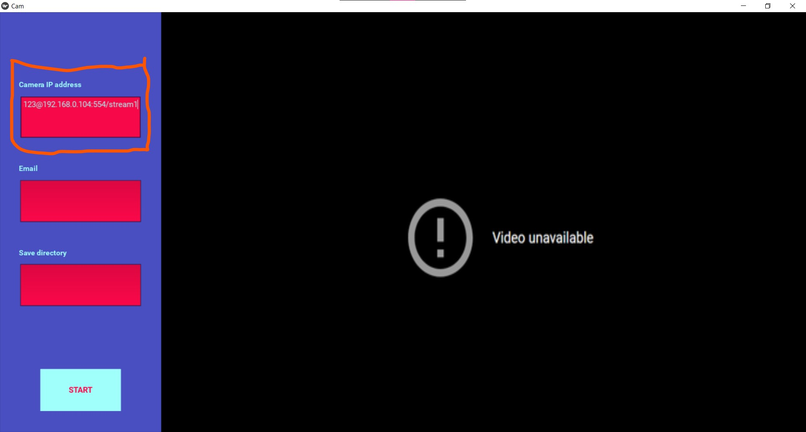
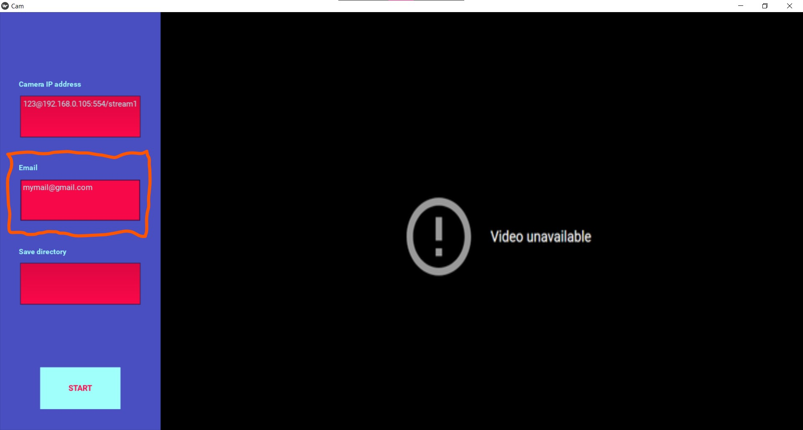
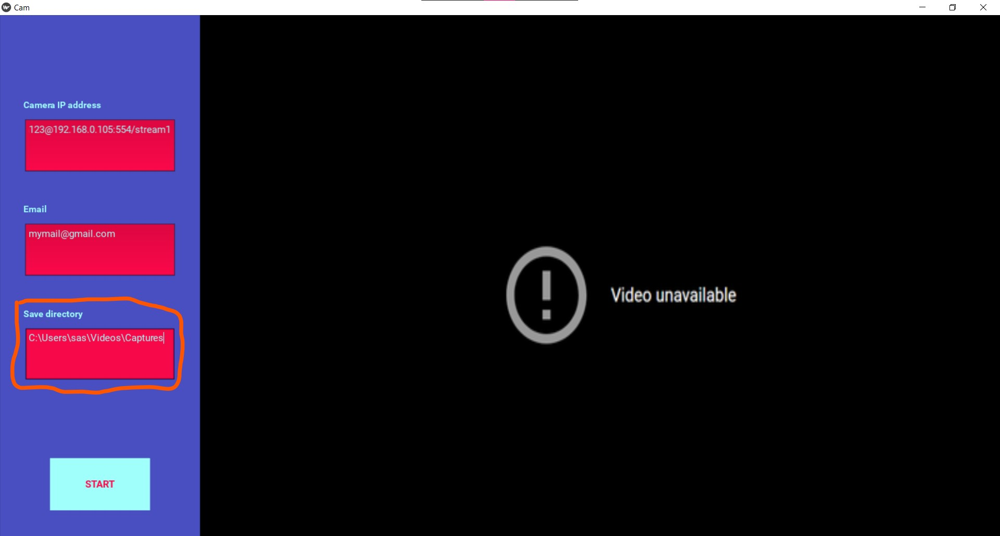

SusCam is a camera with AI, which detects dangerous and suspicious objects. With integrated interface you can easily pair ip camera or usb camera. After detecting forbidden object, the system turns on alarm and records video. This video is sent to the email specified by the user in the app, notifying him of what happened. This AI model is trained by me using my own dataset.

                                    User Guide:
1. Write ip address of your camera in the app. If you have username and password, write it too.

2. Write your email for notifications.

3. Write your save path for videos.

4. Click "Start" button.

5. Camera starts working. If it detects suspicious object, it will send you email with video.

